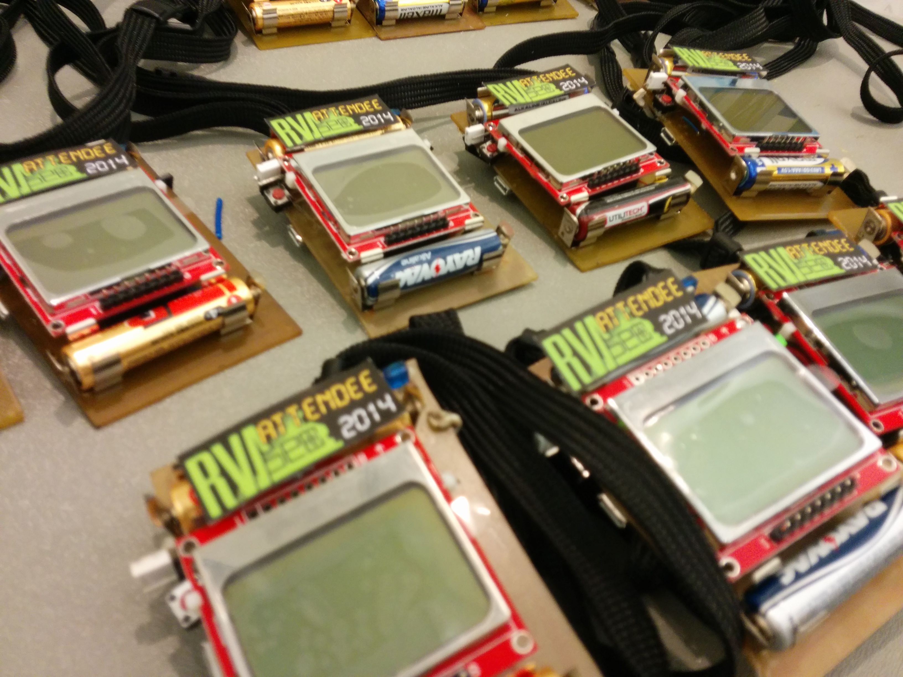

RVAs3c 2014 Badges, by Hack.RVA
====================

This is the official repository of the RVAs3c 2014 Badges, designed and manufactured by the Richmond VA hackerspace, Hack.RVA.

The Badge features a 32-bit Microchip MCU (PIC32MX250128D), Nokia 5110 LCD, two linear capacitive touch sliders, a speaker, 8 yellow LEDs, IR Tx/Rx, micro USB, and a button.
