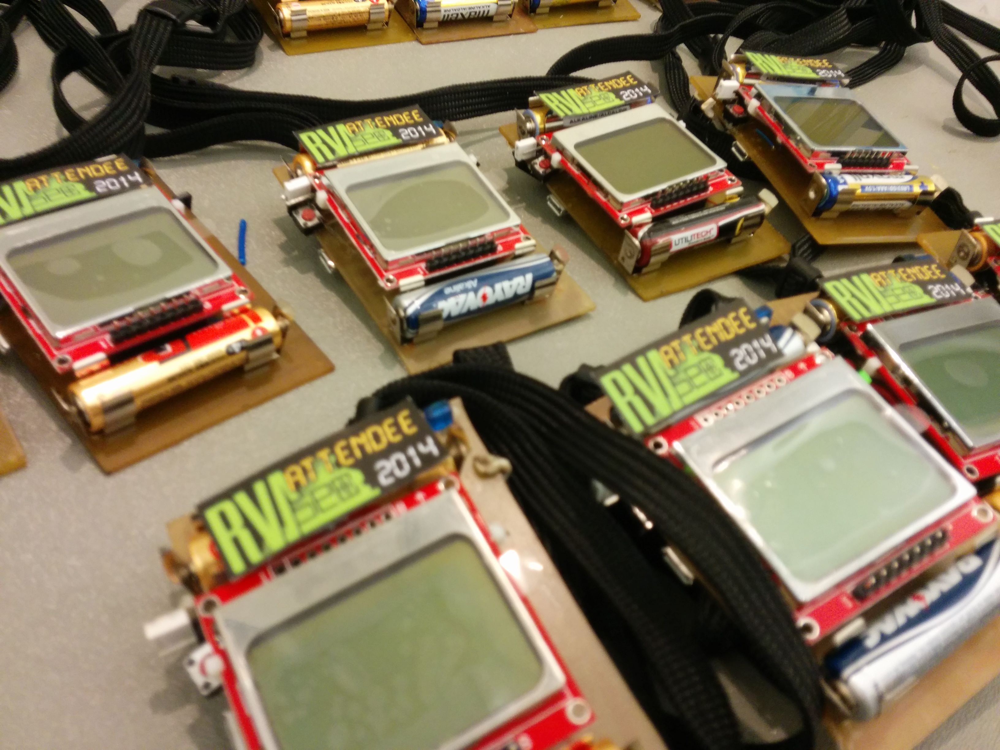

RVAs3c 2014 Badges, by Hack.RVA
====================

This is the official repository of the RVAs3c 2014 Badges, designed and manufactured by the Richmond VA hackerspace, Hack.RVA.

The Badge features a 32-bit Microchip MCU (PIC32MX250128D), Nokia 5110 LCD, two linear capacitive touch sliders, a speaker, 8 yellow LEDs, IR Tx/Rx, micro USB, and a button.

Firmware Status
---
The 'rvase\_day1\_prod' branch will be left as the version flashed to the badges handed out to attendees. Other branches will be various alterations to this, maybe more or less buggy and more or less feature-rich. There is a fourth firmware floating around, but it is not yet publicised.

Data Sheets
---
* [Processor: PIC32MX250F128D](http://ww1.microchip.com/downloads/en/DeviceDoc/60001168F.pdf)
* [LCD Screen: Nokia 5110](https://www.sparkfun.com/datasheets/LCD/Monochrome/Nokia5110.pdf)
* [IR Receiver: VISHAY TSOP39338](http://www.vishay.com/docs/81743/tsop381.pdf)
* [IR Transmit: VISHAY TSKS5400S](http://www.vishay.com/docs/81074/tsks540.pdf)
* [Real-Time Clock: SEIKO SSP-T6-7PF-20PPM](http://www.quartz1.ru/PDF/NC-T3\(SMD03215C2\).pdf)

